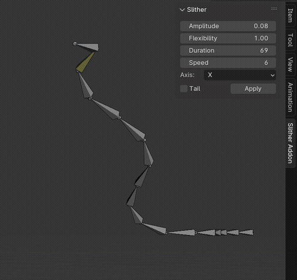
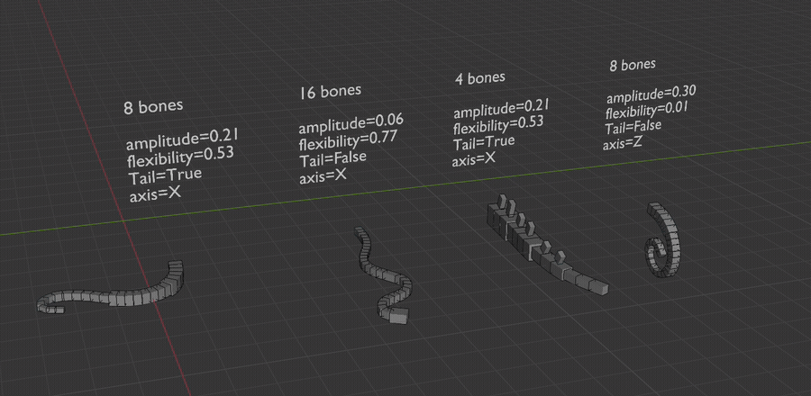
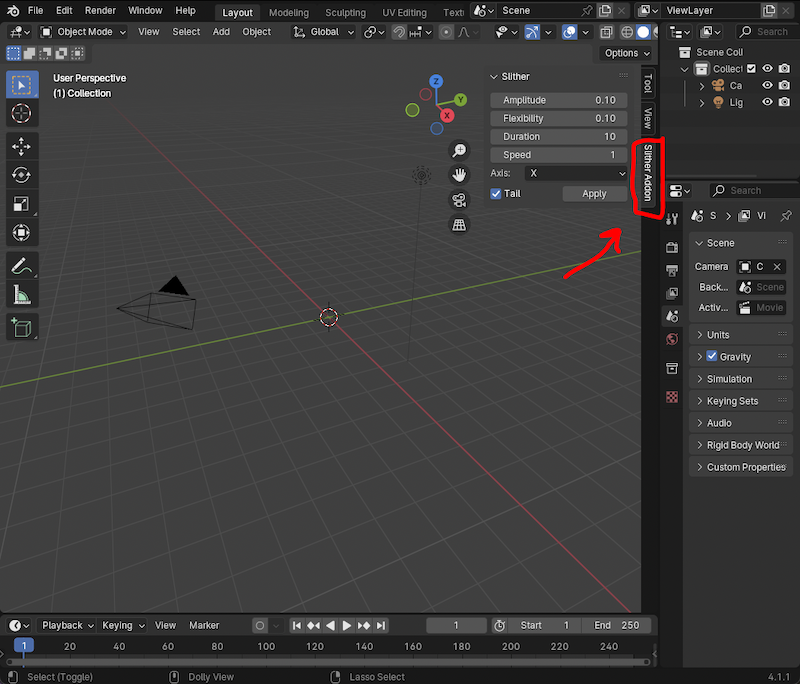

# 🐍 Slither | Animation addon for Blender

Give an armature a repeating slither animation. Quickly animate snakes, tentacles, fish, lizard tails, or your sleep paralysis demon. No complex rigging necessary. 

# ⬇️ [Download Slither Addon](https://github.com/AshleyEM/slither-addon/archive/refs/tags/v1.0.0.zip)

This is my first version, so it might be a bugfest.

[Features](#Features)  
[Install](#Install)  
[Use](#Use)  
[Limitations](#Limitations)  

# Features

* **Axis:** animate across the X, Y, or Z axis
* **Amplitude:** how extreme the slither is
* **Flexibility:** stiff (dinosaur tail) or loose (tentacle)
* **Head or tail:** start slither from head or tail
* **Speed:** keyframe spacing
* **Duration:** how long the animation is

# Install

1. In Blender, navigate to **Edit > Preferences** 
2. Click **Add-ons** and then click **Install**
3. Select the `slither.py` you downloaded
4. In the Search bar, type in 'Slither' to find the addon
5. Check the Slither addon to enable it 

# Use

1. **3D View > Side Bar > Slither Addon** (or press 'N')
2. In **Pose Mode**, select the bones you want to slither
3. Adjust values in the Slither Panel and click **Apply**

Your armature should be a connected chain of bones, with or without an IK handle. More bones = tighter slithering. You can also skip bones when you select them

# Animate a full snake body

The head/tail animations are separate. To animate a full snake body, create a half-head-half-tail rig and apply the head/tail animations separately. You may have to move and scale the keyframes so that the head/tail animations synch up.

# Limitations
🥀 Some annoyances:
* Head/tail animations are separate due to the head-tail nature of Blender bones
* Can only animate along 1 axis at a time
* Animation speed is scaled by the number of bones, not constant
* Amplitude/Flexibility is extremely sensitive

# For the eggheads

The math behind this is just a repeating sine wave function: 

`amplitude * Nth bone * sin(angle +/- (Nth bone * flexibility))`

* `angle` increases indefinately 
* `amplitude` affects how extreme the slither arc is
* `Nth bone` staggers the bone arc amount from head to tail 
* `+` for head movement, `-` for tail movement 
* `flexibility` makes bones at the tip arc more severely than root bones
