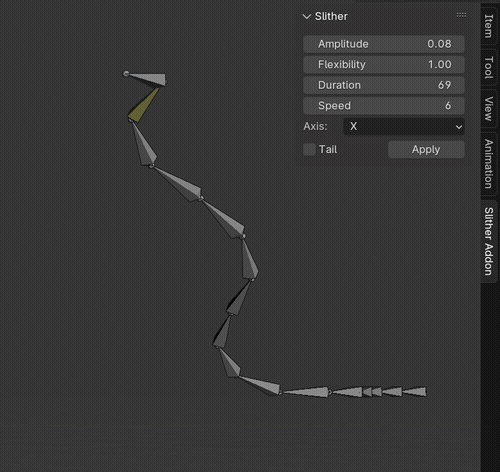
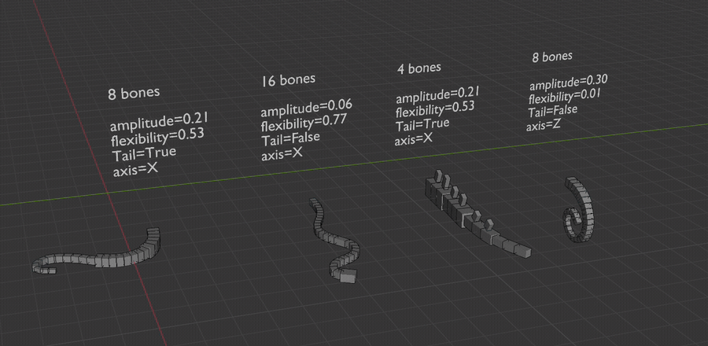
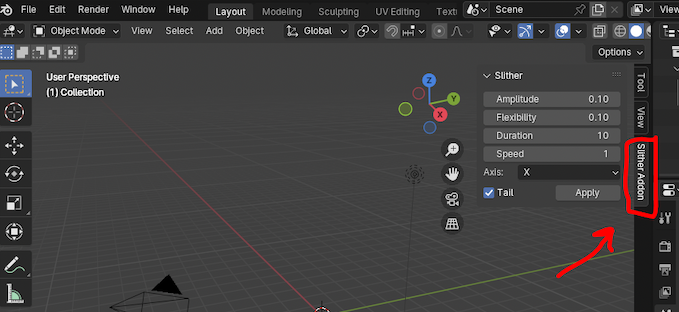
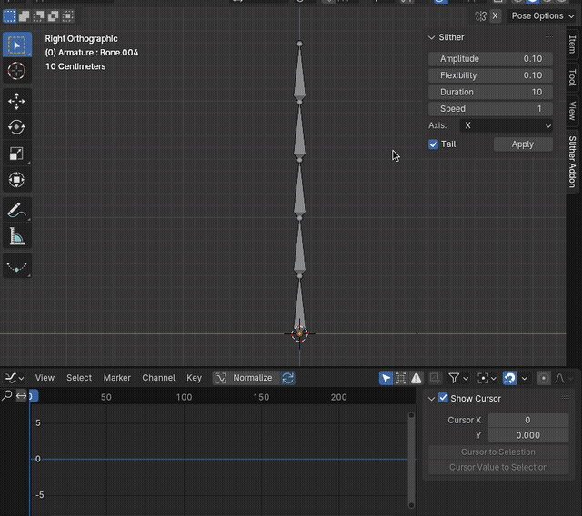

# 🐍 Slither | Animation addon for Blender

Easy way to make an armature slither. Quickly animate snakes, tentacles, fish, lizard tails, or your sleep paralysis demon. No complex rigging necessary. 

# ⬇️ [Download Slither Addon](https://github.com/AshleyEM/slither-addon/releases/download/v1.0.0/slither.zip)

[Install](#Install) 
[Use](#Use) 
[Features](#Features) 
[Limitations](#Limitations) 

# Install
1. Download the addon (above)
2. In Blender, go to **Edit > Preferences** 
3. Click **Add-ons > Install**
4. Select the `slither.zip` you downloaded
5. Check `Animation: Slither` in the window to enable it 
6. Go to **3D View > Side Bar > Slither Addon** (or press `N`)

# Use
1. In **Pose Mode**, select the bones you want to slither (you can skip bones)
2. Adjust values in the `Slither Addon` panel
3. Click `Apply`

Your armature should be a connected chain of bones, with or without an IK handle. More bones = tighter slithering.

# Features

* **Axis:** animate across the X, Y, or Z axis
* **Amplitude:** how extreme the slither is
* **Flexibility:** stiff (dinosaur tail) or loose (tentacle)
* **Head or tail:** start slither from head or tail
* **Speed:** keyframe spacing
* **Duration:** how long the animation is

# Animate a full snake body

The head/tail animations are separate. To animate a full snake body, create a half-head-half-tail rig and apply the head/tail animations separately. You may have to move and scale the keyframes so that the head/tail animations synch up.

# 🥀 Limitations
* Head/tail animations are separate due to the head-tail nature of Blender bones
* Can only animate along 1 axis at a time
* Animation speed is scaled by the number of bones, not constant

# For the eggheads

The math behind this is just a repeating sine wave function tamed into submission: 

`Amplitude * Nth bone * sin(Angle +/- (Nth bone * Flexibility))`

* `Angle` increases indefinately 
* `Amplitude` affects how extreme the slither arc is
* `Nth bone` staggers the bone arc amount from head to tail 
* `+` for head movement, `-` for tail movement 
* `Flexibility` makes bones at the tip arc more severely than root bones
